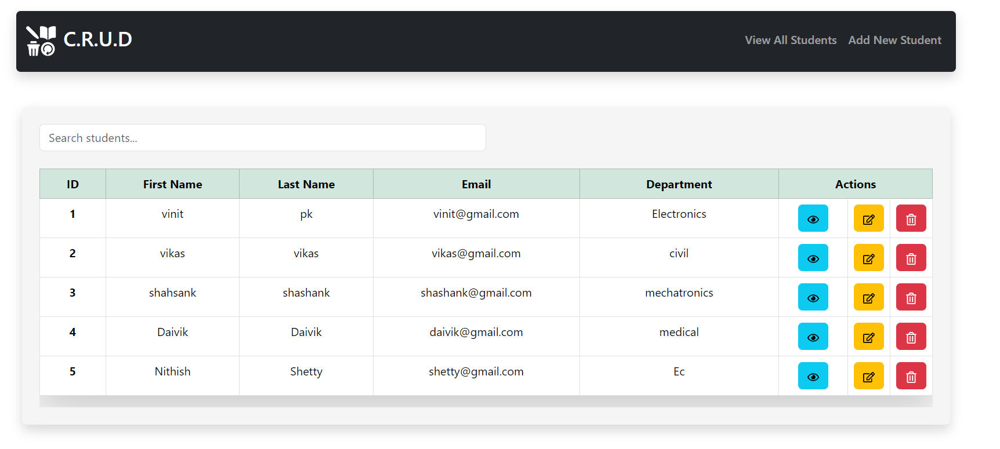

# Spring Boot React CRUD Application

## Overview

This repository contains the source code for a full-stack web application that demonstrates CRUD (Create, Read, Update, Delete) operations on student records. The application is built using Spring Boot for the backend and React for the frontend.

## Features

- **Backend:**
  - Spring Boot RESTful API
  - JPA and Hibernate for data persistence
  - Exception handling with custom exceptions

- **Frontend:**
  - React for the user interface
  - Axios for handling API requests

- **Database:**
  - MySQL database for storing student records

## Project Structure

### Backend

- `com.vinitpk.SpingBootReactCRUD.model`: Defines the data model for the "Student" entity.
- `com.vinitpk.SpingBootReactCRUD.repository`: Spring Data JPA repository for database operations.
- `com.vinitpk.SpingBootReactCRUD.service`: Service layer interfaces and implementations.
- `com.vinitpk.SpingBootReactCRUD.controller`: RESTful API endpoints for CRUD operations.
- `com.vinitpk.SpingBootReactCRUD.exception`: Custom exception handling.

### Frontend

- React components for displaying and interacting with student data.
- Axios requests to communicate with the Spring Boot backend.

## Exception Handling

- Custom exceptions (`StudentNotFoundException` and `StudentAlreadyExistsException`) with a dedicated exception handler (`CustomExceptionHandler`) for clear and meaningful error responses.

## Getting Started

1. **Clone the repository:**
   ```bash
   git clone https://github.com/your-username/CRUD-SpringBoot-Backend-Application.git

## Website ScreenShot
